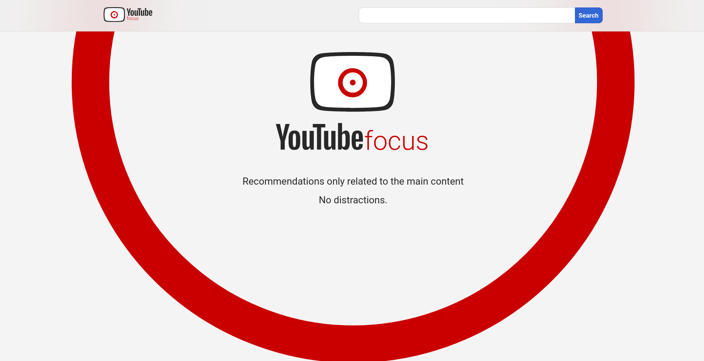
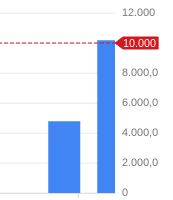

<h2 align="center">Welcome to Youtube Focus repository</h2>
<h4 align="center"> 
	🚧  In developement...  🚧
</h4>

## Project Description

Study or do whatever you want on youtube without distractive recommendations 🚀

<!--ts-->

- [About](#About)
- [Features](#Features)
- [Instalation](#Instalation)
- [How to use](#How)
- [Tecnologies](#Tecnologies)
- [Problems](#Problems)
<!--te-->

<h2 href="#About">About</h2>

This project was inspired by a personal need. When i was in high school or university and had to study some content in video class youtube always recommended some unrelated videos which made it very difficult to concentrate. YT Focus removes the smart YouTube recommendation based on your tastes with anonymous queries. :D 

<h2 href="#Features">Features</h2>

- [x] Search
- [x] List Videos, paging
- [x] Recommendation component based on main video

<h2 href="#Instalation">Instalation</h2>

<!--ts-->

- After clone Run yarn on terminal to install dependencies
- Config Google API key
  - As google API is private and has limited Queries you will have to use yours
  - [How to create youtube API Key](https://www.youtube.com/watch?v=3jZ5vnv-LZc)
  - With your API key go to `src/services/api_key_example.js` paste the key into the const API_KEY and rename the file to `api_key.js`
  - If your api key is correct and still having queries the project will run :D
  <!--te-->

<h2 href="#How">How to use</h2>

    
    
is just like Youtube but simpler

    
    
    
when clicking on a video you are going to be redirected to the player page

<h2 href="#Tecnologies">Tecnologies</h2>
<!--ts-->

- React
- Redux
- Styled Components
- Youtube DATA API v3

<!--te-->

<h2 href="#Problems">Problems</h2>

As it is based on  Google's API queries system that is limited to a certain amount of requisition per day I don't know how to scale it, like, create a real site is just impossible, each requisition is something like 100 Queries and you have only 10k. I still dont know how to solve it

